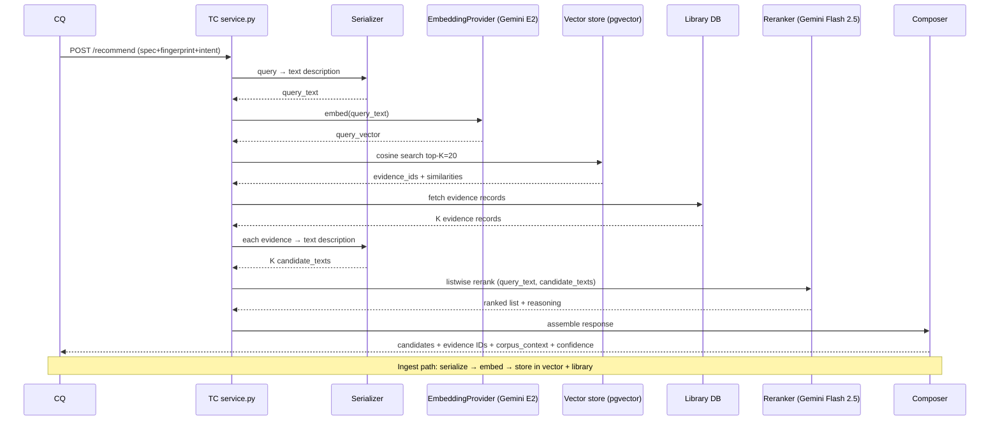

# The Commons — Matchmaker Design Cycle

> 매치메이커를 LightGBM에서 **Hybrid retrieve-and-rerank** (자연어 직렬화 + Gemini Embedding 2 + Gemini Flash 2.5 listwise)로 재정의. multi-modal native, evidence-backed, LLM-friendly.

## 왜 이 아이디어인가

직전 v0.1-design cycle에서 매치메이커를 LightGBM lambdarank로 정했지만, PI Lab brand가 *비전 AI 중심*이라는 사실이 결정의 전제를 흔들었다. v0.1 tabular vertical slice라도 *애초에 multi-modal-ready ranker*가 합리적. LightGBM은 tabular feature space에 묶여 v0.2 비전·NLP 진입 시 결국 교체 필요.

핵심 통찰 셋:

1. **(b)(c)(d) 알고리즘 분리는 결국 환상이었지만 *다른 형태*로 재발견됨** — 직전엔 *데이터 양에 적응*하는 단일 ranker였다면, 이번엔 *modality에 적응*하는 단일 ranker. 자연어 직렬화 + LLM rerank가 tabular/vision/NLP 모두 *같은 stack*으로 작동.

2. **자연어 직렬화가 추상화 root** — query/evidence를 *text description*으로 표현하면 (a) embedding model 자유 교체, (b) LLM이 reasoning 직접 활용, (c) modality 추가 시 *template 한 줄 변경*. structured feature vector(LightGBM 시절)는 이 모든 자유도를 잃음.

3. **Google ecosystem 통일 + Protocol 추상화 = 단기 속도 + 장기 자유도** — Gemini Embedding 2 + Flash 2.5가 *현재* 가장 균형. Protocol 추상화로 미래 DeepSeek V4 / Voyage / Local 자유 전환.

## 풀고자 하는 문제

v0.1-design cycle 끝난 시점에 남은 문제:

1. **LightGBM이 PI Lab brand와 어긋남** — 비전 AI 중심 lab이 첫 출시부터 tabular-only ranker로 시작하면 v0.2 진화가 *전면 교체*. 시간·비전 정합 모두 비용 큼.
2. **매치메이커 quality는 *입력 표현*에서 결정** — feature engineering이냐 자연어 직렬화냐가 모든 후속 결정(embedding·rerank·학습)의 전제.
3. **LLM rerank의 *비용·정밀도·multi-modal* 균형** — pairwise는 정밀하지만 비쌈, listwise는 효율적이지만 long context 필요, two-stage는 운영 복잡.

## 이번 사이클의 확정 결정

### #1 Query/candidate 표현 = 자연어 직렬화 (template-based)

```
[QUERY TEMPLATE v1]
"{modality} dataset: {sample_count_band} samples, {feature_or_shape_desc},
 {task_type_phrase}, class balance {class_balance_band}.
 Hardware: {gpu_or_cpu_desc}, {ram_gb}GB RAM.
 Goal: {intent_goal_phrase} (target {metric}={expected_baseline} ± {tolerance})."

[CANDIDATE EVIDENCE TEMPLATE v1]
"{recipe_family} run on {modality} {sample_count_band} {task_type_phrase}.
 Observed: {primary_metric}={value} ± {std} over {n_observations} runs.
 Runtime: ~{runtime_band}.
 Tier: {real|synthetic}.
 Hyperparams summary: {compressed_params}."
```

Template은 versioned (v1, v2, ...)으로 자체 spec 문서. corpus가 자라며 template이 바뀌면 *기존 evidence re-embed* batch job 발동.

### #2 매치메이커 = 6 컴포넌트 monolith (Python package boundary)

```
matchmaker/
├── serializer/       # template registry + slot filler + band quantizer + modality adapter
├── embedding/        # EmbeddingProvider Protocol → GeminiEmbedding2 구현체
├── retriever.py      # pgvector cosine search top-K
├── reranker/         # LLMReranker Protocol → GeminiFlash25Listwise 구현체
├── composer.py       # API 응답 조립 (corpus_context, evidence IDs, confidence)
└── service.py        # POST /recommend 진입점
```

### #3 Embedding model = Gemini Embedding 2

- 2026-03-10 출시. text/image/video/audio 모두 native.
- v0.1 tabular엔 text-only로 충분, v0.2 비전 진입 시 *embedding 측 변경 0*.
- $0.10/M tokens 수준 — v0.1 비용 미미.

### #4 LLM Reranker = Gemini Flash 2.5

- $0.30/$2.50/MTok 입력/출력. 1추천 ~$0.001.
- 1M context로 listwise K=20 candidates 한 prompt에 여유.
- multi-modal native (v0.2 비전 진입 시 이미지 첨부 가능).

### #5 Rerank 방식 = Listwise (1회 호출)

```
prompt: "Query: <serialized query>

Candidates (rank these from best to worst for the query):
1. <evidence1 description>
2. <evidence2 description>
...
20. <evidence20 description>

Return ranked list with reasoning for top-5."

→ Gemini Flash 2.5 1회 호출, latency 2~3초
```

장점: 1회 호출, candidates 간 *비교 reasoning* 가능, K=20을 1M context에 여유롭게 압축.

### #6 Local model path = Protocol 추상화 + v0.2 평가

```python
class LLMReranker(Protocol):
    def rerank(self, query: str, candidates: list[str]) -> list[RankedCandidate]: ...

class EmbeddingProvider(Protocol):
    def embed(self, text: str) -> Vector: ...

# v0.1 구현체
GeminiFlash25Reranker
GeminiEmbedding2Provider

# v0.2~0.3 후보
DeepSeekV4APIReranker    # API + open weights 동시 — 같은 모델로 local 전환 자연스러움
DeepSeekV4LocalReranker  # SGLang serving on PI Lab GPU
QwenLocalReranker        # multi-modal 강
VoyageMultimodal3Provider
```

v0.2 평가 기준: cost (월 운영비), latency, A/B quality, vendor lock-in.

## 데이터 흐름 (Mermaid)



## Stack 변경 요약

| 영역 | v0.1-design 시 | **이번 사이클 후** |
|---|---|---|
| Ranker 알고리즘 | LightGBM lambdarank (training 필요) | **Hybrid retrieve-and-rerank (training 없음)** |
| Vector representation | structured feature vector | **자연어 description** |
| Retrieve | (없음, ranker가 직접 처리) | **pgvector cosine on embedding** |
| Embedding | (없음) | **Gemini Embedding 2** |
| Rerank | (LightGBM 일체형) | **Gemini Flash 2.5 listwise** |
| Multi-modal v0.2 | embedding 교체 + ranker 교체 (전면) | **template 한 줄 추가, embedding model 그대로** |
| Cold start | synthetic seed로 ranker 학습 | **LLM background knowledge + synthetic vector DB 채움** |
| Operating cost | DB only | DB + ~$50~100/month (Gemini API) |
| 자체 학습 모델 | LightGBM (corpus로 학습) | **없음 (v0.3+ contrastive fine-tune 옵션)** |

## 비용·Latency 예산

| 작업 | API call | 추정 |
|---|---|---|
| Evidence ingest 1건 | 1× Gemini Embedding 2 | ~$0.0001, <100ms |
| Recommend 1회 | 1× Gemini Embedding 2 + 1× Gemini Flash 2.5 | ~$0.001~$0.002, 2~3초 |
| 월 10,000 query | embedding + rerank | ~$20~50/month |
| 월 10,000 ingest | embedding | ~$10~20/month |
| **합계 v0.1 scale** | | **~$50~100/month** |

Local model 전환 (v0.2+) 시 API 비용 → GPU h 비용 (Blackwell 1대 가정 ~$1.50/h × 24h × 30 = $1,080/month, 단 자체 인프라 활용 시 sunk cost).

## 비전 정합 재점검

| 비전 약속 | Hybrid 매치메이커에서 |
|-----------|------------------|
| #1 stateless advisor | ✅ 매 호출 stateless (vector DB lookup + LLM call) |
| #2 intent 3필드 | ✅ template slot에 intent 직렬화 |
| "null/negative 1급" | ✅ failed evidence도 vector space에. LLM rerank가 "이 시도는 실패함"을 reasoning에 활용 |
| "evidence-backed" | ✅ 응답에 근거 evidence IDs 첨부, retrieve가 corpus에서 |
| Synthetic seed | ✅ synthetic도 같은 vector space에 임베딩. tier filter로 비율 조정 |
| L1 immutable | ✅ embedding vector는 evidence content hash에 묶여 immutable |
| Multi-modal v0.2 | ✅ Gemini Embedding 2 이미 multi-modal, template만 추가 |
| Reciprocity 이벤트 측정 | ✅ retrieve 시 evidence ID 기록 → loop closure event 추적 |

## 요구사항 (EARS)

### 기능 요구사항

- **R1** WHEN evidence가 deposit될 때, Serializer가 template v{n}으로 자연어 description을 생성하고 Embedding provider가 vector를 반환받아 vector store와 library DB에 같은 트랜잭션으로 저장한다.
- **R2** WHEN query가 들어올 때, Serializer가 query description을 생성하고 Embedding provider가 query vector로 변환하여 vector store에서 top-K=20 evidence를 cosine similarity로 retrieve한다.
- **R3** WHEN retrieve 결과가 K개 미만일 때 (corpus 진짜 sparse), Reranker는 휴리스틱 fallback 또는 LLM-as-generator로 cold start 후보를 응답하고 confidence 라벨에 "weak_heuristic"을 표시한다.
- **R4** WHEN Reranker가 호출될 때, listwise 1회 LLM call로 K candidates를 top-N=5로 ranking하고 각 후보에 reasoning text를 첨부한다.
- **R5** WHEN Composer가 응답을 만들 때, 응답에 corpus_context (real_count + synthetic_count), 근거 evidence IDs, confidence label, LLM reasoning text를 포함한다.
- **R6** WHILE corpus가 sparse한 cluster에 대해, synthetic-dominant 후보엔 "verify by running" 경고를 응답에 첨부한다.
- **R7** WHEN template version이 v{n}에서 v{n+1}로 변경될 때, re-embed batch job이 기존 evidence를 새 template으로 재직렬화하고 vector를 재계산한다.

### 비기능 요구사항

- **multi-modal-ready**: v0.1엔 text-only template, v0.2엔 image caption template 추가. embedding/reranker 모델 측은 변경 0.
- **Protocol 추상화**: EmbeddingProvider, LLMReranker, VectorStore 모두 Protocol. 구현체 자유 교체.
- **interpretability**: 모든 추천에 근거 evidence IDs + LLM reasoning text.
- **operating cost**: v0.1 scale에서 월 $50~100. Local 전환 시 GPU h 비용으로 옮겨감.
- **latency**: 추천 1회 2~3초 (Gemini Flash 2.5 long context 한계).
- **stateless**: 매 query 처음부터 처리. cache는 부수적 최적화.

### 범위 외

- 구체 prompt template wording (plan)
- pgvector index 파라미터 (m, ef_construction 등) (plan)
- LLM rate limit 정책, retry, circuit breaker (plan)
- v0.2 local model 평가 프로토콜 (별 cycle)
- 자체 fine-tuned embedding/reranker (v0.3+ cycle)
- Caching strategy 정밀 (TTL, invalidation 정책) — plan

## 리스크

| 리스크 | 심각도 | 초기 대응 |
|--------|--------|----------|
| Template quality가 매치메이커 quality에 직격타 | 높 | Template을 versioned spec 문서로 관리. PI Lab 내부 사용자에게 *추천 reasoning*을 review시켜 template 튜닝 |
| Gemini API vendor lock-in | 중 | Protocol 추상화 day-one에 박음. v0.2 DeepSeek V4 / Voyage 평가 cycle 약속 |
| 자연어 직렬화 시 수치 정밀도 손실 | 중 | 대역 표현이 PHI 차단과 정합. 추천 정밀도는 대역 단위면 충분 (실험 결과 분산이 대역 안에 들어감) |
| LLM hallucination (reasoning text가 evidence와 불일치) | 중 | 응답에 evidence IDs 첨부 → 사용자가 검증 가능. PI Lab 내부 monitoring으로 fail case 수집 |
| Listwise rerank의 K=20 prompt가 latency 증가 | 낮 | Flash 2.5 1M context면 K=20은 small. ~2초 측정. K↑ 시 two-stage 검토 |
| Synthetic seed의 vector space 위치가 부정확 → retrieve quality 약화 | 중 | LLM 생성 후 PI Lab 검증 단계. *대표 query*로 retrieve test |
| Template 변경 시 re-embed batch가 비용 폭증 (모든 evidence 재임베딩) | 중 | template 변경 *최소화 정책*. major version 변경은 분기별 1회 한정 |
| Embedding이 multi-modal이지만 v0.1 청중은 tabular라 *과한 모델* | 낮 | text-only 청구 + 다른 modality 추가 시 즉시 활용. cost 미미 |

## 탐구 중 발견한 인사이트

1. **(b)(c)(d) 알고리즘 분리는 환상**이라는 직전 통찰이 *다시 한 단계 진화* — 단일 ranker가 데이터 양에 적응 → 단일 stack이 *modality*에 적응. 자연어 직렬화가 이 진화의 root.
2. **PI Lab brand(비전 AI) 가 매치메이커 stack 결정의 *late-arriving* 제약** — 직전 cycle엔 tabular vertical slice에 LightGBM이 자연 선택이었지만, 사용자 직관(비전 AI lab이라 LightGBM은 부적합)이 정합 깨뜨림. *brand가 stack의 root 제약*임을 학습.
3. **Google ecosystem 통일이 vendor lock-in이 아니라 *통합 가속*** — Embedding 2 + Flash 2.5가 같은 family라 API tooling 일관성 + multi-modal v0.2 진입 비용 0. Protocol 추상화로 lock-in risk 제거.
4. **자연어 직렬화가 LLM-as-everything 패러다임 직역** — corpus = text corpus, query = text, evidence = text. 모든 transformer 진화(reasoning model, agent loop, fine-tune)가 *그대로* 우리 stack에 적용됨.
5. **Template versioning이 진화의 *핵심 인터페이스*** — v0.1 v1, v0.2 v2 (vision 추가), v0.3 v3 (LLM이 자동 generate). template이 매치메이커 quality에 직격타이지만 *교체 가능한 component*로 추상화됨.
6. **자체 학습 모델이 없는 architecture가 *유지보수 부담* 0** — v0.1엔 우리가 학습할 모델 없음. 모두 외부 모델 + template + corpus. retrain pipeline·model versioning·MLOps overhead 모두 *유예*. v0.3+에 fine-tune 시작.

## 다음 사이클 후보

1. **Template registry 정밀화** — v1 template 구체 wording, slot 정의, band quantizer 규칙
2. **Cold start fallback 정밀화** — corpus 진짜 빈 상태에서 LLM-as-generator 호출 정책
3. **Synthetic seed 새 역할** — vector space 채우는 단위 결정 (cluster당 몇 건?)
4. **Confidence label 산정식** — corpus density + similarity + LLM 자체 confidence 조합
5. **Caching strategy** — query fingerprint hash → cache TTL, invalidation 정책
6. **Plan 단계 인수인계** — v0.1 task graph 재정의 (LightGBM 태스크 제거, Hybrid 태스크 추가)
7. **v0.2 local model 평가 프로토콜** — DeepSeek V4 / Qwen / Voyage A/B 비교 방법

## 참고 자료

- 직전 cycles (this directory):
  - `the-commons-vision.md`
  - `the-commons-architecture.md`
  - `the-commons-v0.1-design.md` (LightGBM 결정 — 이번 사이클로 일부 수정)
  - `the-commons-onboarding.md`
  - `the-commons-success-metrics.md`
- 비전 문서: `/Users/changmin/git/TheCommons/README.md`
- Design doc: `.c4/designs/the-commons-v0.1.md` (이번 사이클로 갱신 필요)
- Knowledge insights: ins-0265526c, ins-d79f75a6, ins-dac4c2ad, ins-341daecf, ins-7ed6f07b, ins-e112ae22

## 관련

- [[the-commons-vision]]
- [[the-commons-architecture]]
- [[the-commons-v0.1-design]]
- [[the-commons-onboarding]]
- [[the-commons-success-metrics]]

---

*Generated by /pi on 2026-05-13 — matchmaker design cycle: 6 root decisions (자연어 직렬화 + 6 컴포넌트 + Gemini Embedding 2 + Gemini Flash 2.5 + Local Protocol + Listwise rerank)*
